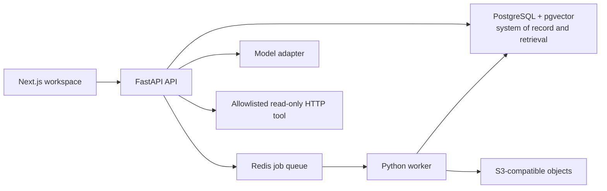

# Build the agentic knowledge workspace

## Product contract

The first release serves one complete workflow:

1. A member enters the default workspace and uploads a Markdown, text, PDF, CSV, or JSON source.
2. A worker stores the original, extracts bounded text, chunks it, and makes it searchable.
3. The member asks a question and receives a resumable streamed answer with source citations.
4. An agent may propose one configured, read-only HTTP request. The request pauses for approval when required.
5. The member approves or denies the request, sees its bounded result, and can inspect the complete audit trail.
6. The member can open a citation, inspect provenance, or delete the source and its derived data.

Non-goals for the first release are Neo4j, a graph explorer, arbitrary MCP/REST configuration, code execution, data warehouses, a dashboard editor, and generated-app publishing.

## Measurable release gates

- A reconnect using `Last-Event-ID` receives every later event exactly once from the API event log.
- Repeating a message, upload, approval, or tool-execution request with the same idempotency key does not duplicate durable work.
- A restarted API or worker resumes queued/running work without losing the user-visible terminal state.
- A 10 MB source is accepted or rejected within documented limits; ingestion reaches a terminal state within 60 seconds in the local reference environment.
- Retrieval returns within 1.5 seconds at p95 on the seed corpus, excluding model generation.
- The evaluation corpus meets at least 90% citation precision and 80% retrieval recall@5 before graph expansion is considered.
- Source deletion immediately hides the source from reads and removes derived chunks within 60 seconds; retryable cleanup remains auditable.
- Every workspace-owned query includes an enforced workspace scope and passes cross-workspace isolation tests.
- Tool requests enforce HTTPS, method and host allowlists, redirect revalidation, private-address blocking, a 10-second timeout, and response-size caps.
- The documented local stack starts without paid services. Model, embedding, object-storage, and tool transports have deterministic development adapters.

## Architecture decisions

- Use a pnpm workspace rooted at `apps/web`, `apps/api`, `apps/worker`, and `packages/api-client`.j
- Use Next.js App Router, FastAPI, SQLAlchemy/Alembic, Pydantic, and a Redis-backed worker adapter.
- Use PostgreSQL for ownership, durable run events, full-text search, embeddings, provenance, approvals, and the transactional outbox.
- Use an S3-compatible adapter for source originals. The development adapter stores objects on a named local volume.
- Keep model and embedding providers behind interfaces with deterministic local implementations.
- Generate the TypeScript client from OpenAPI and fail CI on client drift.
- Record consequential decisions in `docs/adr`; do not add a new stateful service without an ADR and an observed need.

## Durable execution contract

Runs move through `queued`, `running`, `waiting_for_approval`, `cancelling`, `completed`, `failed`, or `cancelled`. Tool calls move through `proposed`, `approved`, `denied`, `executing`, `succeeded`, or `failed`.

- Persist the user message, run, and initial event atomically before generation starts.
- Give each run event a per-run monotonic sequence number and immutable payload.
- Resume streams after a supplied event sequence; heartbeat frames are not persisted.
- Require idempotency keys at mutation boundaries and store their response identity.
- Claim queued work with a lease. Expired leases are recoverable.
- Cancellation prevents new model/tool work, records a terminal event, and ignores late provider output.
- External tool execution uses a durable execution key. Automatic retries are allowed only for operations declared safe and read-only.
- Approval decisions are immutable and actor-attributed.

## Trust boundaries

- Treat uploaded bytes, extracted text, URLs, model output, tool arguments, and tool responses as untrusted.
- Validate type from content and extension, cap bytes/pages/rows, sanitize filenames, and never execute uploaded content.
- Require HTTPS tool destinations from an administrator-configured host allowlist. Resolve and validate every address and redirect; block loopback, link-local, private, multicast, and metadata networks.
- Never expose connector credentials to prompts or browser code. Redact authorization headers and configured secrets from logs and audit payloads.
- Bind sessions and API tokens to a workspace and role; rotate sessions at authentication boundaries and protect cookie-authenticated mutations from CSRF.
- Apply input, output, time, concurrency, and token limits at API, worker, model, retrieval, and tool boundaries.

## Vertical slices

### Slice 0: contracts and foundation

- Scaffold the monorepo and local Compose stack for PostgreSQL/pgvector, Redis, and object storage.
- Add health/readiness endpoints, migrations, structured request/run/job IDs, linting, type checking, tests, and CI.
- Implement a development identity header only in development. Keep the authentication interface ready for a production OIDC adapter.
- Add `workspace_id` ownership and stable UUIDs to every domain record.
- Exit gate: clean setup, migration, seed, lint, typecheck, unit tests, and cross-workspace integration test.

### Slice 1: durable chat

- Model conversations, messages, runs, run events, idempotency records, and audit events.
- Implement conversation/message CRUD, deterministic local generation, resumable SSE, retry, and cancellation.
- Build chat history, composer, event rendering, reconnect behavior, and failure recovery.
- Exit gate: reconnect, duplicate mutation, cancellation race, expired lease, and API restart tests pass.

### Slice 2: cited memory

- Model sources, source objects, ingestion jobs, chunks, embedding versions, and citations.
- Accept bounded file uploads and enqueue idempotent ingestion.
- Extract and chunk supported content, retain provenance offsets, and index PostgreSQL full-text search. Enable pgvector when an embedding provider is configured.
- Fuse full-text and vector rankings with reciprocal-rank fusion and return a token-budgeted evidence set.
- Establish a checked-in evaluation corpus and report recall@5, citation precision, unsupported-answer rate, latency, and cost.
- Implement tombstone-first deletion plus retryable physical cleanup.
- Exit gate: ingestion recovery, retrieval evaluation, citation navigation, deletion, and tenant-isolation tests pass.

### Slice 3: permissioned read-only tool

- Add administrator-defined HTTPS GET tool configurations, agent grants, proposed calls, approvals, executions, and audit events.
- Validate arguments against a typed schema and enforce destination/network limits at execution time.
- Pause and resume the durable run around approval.
- Exit gate: grant denial, approval races, SSRF/redirect cases, timeout, oversized response, redaction, and replay tests pass.

### Slice 4: workspace UI and release

- Deliver a cohesive interface for chat, sources, ingestion state, approvals, citations, provenance, deletion, and audit history.
- Add Playwright coverage for upload-to-cited-answer, reconnect, approval/denial, and delete-to-no-result journeys.
- Publish the OpenAPI contract, setup guide, runbook, backup/retention guidance, and known limitations.
- Exit gate: all measurable release gates pass in CI and from a clean local checkout.

## Follow-on decision gates

### Phase 2: graph memory

Prototype entity/relation extraction against the evaluation corpus. Add Neo4j as a rebuildable projection only if bounded graph expansion produces a material, repeatable retrieval-quality improvement that justifies its consistency and operational costs.

### Phase 3: analytical workspace

Introduce versioned Parquet datasets, a typed query AST, bounded DuckDB execution, and declarative dashboards. Define schema-evolution and resource-isolation contracts before implementation.

### Phase 4: generated applications

Complete a dedicated threat model for generated dependencies, builds, previews, static artifacts, origins, CSP, dataset-token audiences, and publication rollback. Generated server code must never execute in the primary application environment.